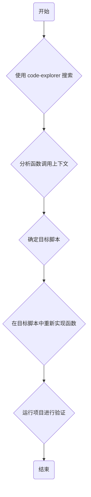

## 产品概述

本计划旨在修复一个因函数意外删除而引发的 Godot 项目运行时错误。

## 核心功能

- **错误定位**：确定 `get_game_def_data_child` 函数的调用位置以及它应该被定义的脚本文件。
- **函数恢复**：在正确的脚本中重新实现 `get_game_def_data_child` 函数，使其恢复预期的功能。
- **功能验证**：运行项目以确认 `Invalid call. Nonexistent function` 错误已解决，且相关功能恢复正常。

## 技术栈

- **语言**: GDScript
- **引擎**: Godot Engine 4.5

## 架构设计

此任务不涉及架构变更，而是对现有代码库进行修复。修复过程将遵循以下步骤：

### 数据流

修复流程将集中在代码探索和函数实现上。

## 技术实施计划

1.  **问题陈述**: 运行时发生 `Invalid call. Nonexistent function 'get_game_def_data_child'` 错误，导致程序中断。
2.  **解决方案**:

    -   使用 `code-explorer` 代理在整个项目中搜索 `get_game_def_data_child` 的调用点。
    -   分析搜索结果，理解该函数的用途、参数和预期的返回值。
    -   根据上下文，在最合适的脚本（例如，一个全局工具脚本或父节点脚本）中重新编写该函数。
    -   函数实现将基于其名称推断，可能用于从某个“游戏定义数据”节点中获取指定的子节点。

3.  **潜在挑战**: 如果函数的原始逻辑复杂，可能需要根据调用上下文进行更深入的分析和推断，以确保新实现的逻辑完全符合原始设计。

## 代理扩展

### SubAgent

- **code-explorer**
- **目的**: 在整个 Godot 项目代码库中搜索对缺失函数 `get_game_def_data_child` 的所有调用。
- **预期结果**: 提供一个包含该函数调用的文件和行号列表，为理解其上下文和确定其应在何处定义提供依据。